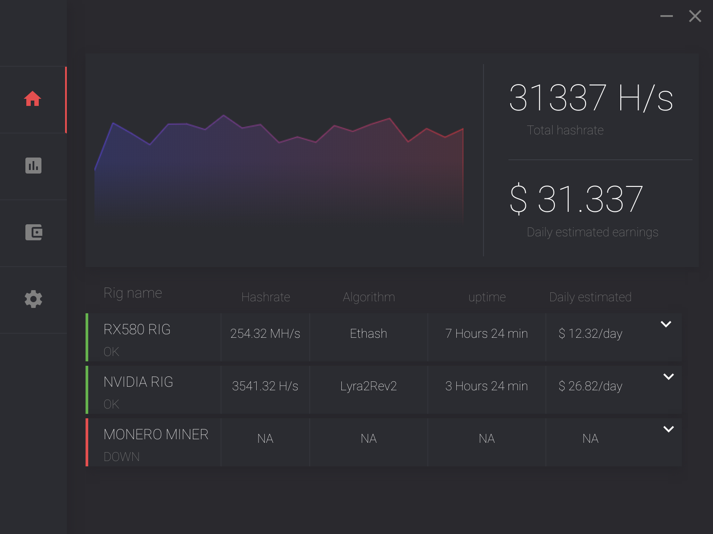

# Openhash

Openhash is an crypto-mining app and an opensource project started back in 2017 righ after Nicehash, which at the time was the leading Mining desktop app had suffered a $64 Million hack. The project has unfortunately been discontinued since.
This is an early frontend dashboard prototype built on Electronjs.

## UI 🖥

## Usage
`npm start`

